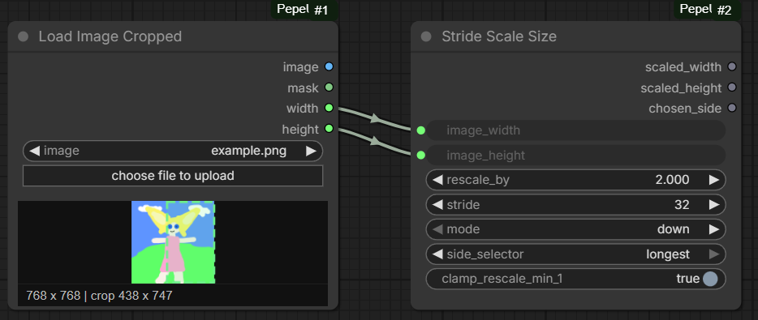

# ComfyUI-PepeUtils

Small utility nodes for [ComfyUI](https://github.com/comfyanonymous/ComfyUI).

Currently included:

- **Anime PromptGen** - generates anime prompt text with the FredZhang7 GPT-2 prompt generator or a compatible local GGUF file through Transformers.
- **Pepe Equirectangular Preview** - interactively previews LDR Lat-Long panoramas with mouse rotation, wheel zoom, and fullscreen viewing.
- **Pepe Equirectangular to Cubemap Strip** - converts a panorama into a horizontally tileable strip of configurable perspective faces; four sides produce a cubemap.
- **Pepe Equirectangular to Cylindrical** - reprojects a panorama onto a constant-radius cylinder and unrolls it into a seamless image.
- **Load Image Cropped** - loads an image and returns a cropped image + mask, with an interactive crop preview in the ComfyUI frontend.
- **Pepe Paste Image** - pastes a clipboard image into a selected node and keeps it only in ComfyUI's temporary storage.
- **Pepe Image Filter** - pauses a workflow and lets you select which images from a batch continue, with matching latent and mask passthrough.
- **Pepe Lazy Route** - selects one of eight inputs without evaluating the unselected branches.
- **Pepe Route Split** - starts one of eight routes and blocks the other routes, including independent Save/Preview paths.
- **Pepe Resize Image** - resizes, crops, pads, or pillarboxes images with automatic Lanczos upscale and Pepe Bicubic Sharper downscale selection.
- **Pepe Scale Image By** - scales images with a Photoshop Bicubic Sharper style approximation based on configurable cubic resampling.
- **Stride Scale Size** - computes width/height snapped to a chosen stride after scaling.

## Node Screenshots



## Installation

### Option 1: Git clone

Clone this repository into your `ComfyUI/custom_nodes` directory:

```bash
git clone https://github.com/Pepehoschi/ComfyUI-PepeUtils.git
```

### Option 2: Download ZIP

Download this repository as a ZIP, extract it, and place the folder here:

```text
ComfyUI/custom_nodes/ComfyUI-PepeUtils
```

Then restart ComfyUI.

## Pepe Image Filter

Connect an image batch and queue the workflow. The node opens an interactive image grid where you can select one or more images, zoom for inspection, and send the selection onward. When provided, matching latent samples and masks are selected with the images. The three optional extra text values are also editable in the selection popup.

Enable `equirectangular_projection` to open still-image candidates directly in an interactive panorama viewer. Drag to look around, use the mouse wheel to adjust the field of view, and use the arrow buttons or keyboard arrows to compare candidates while keeping the same viewing direction. **Select/Unselect** (or **Enter**) toggles the current candidate, **Grid** or **Esc** returns to the flat overview, **Reset** restores the default view, and the fullscreen button expands the projection. Grouped video previews (`video_frames > 1`) continue to use the existing flat animated view.

`pick_list` bypasses the popup with comma-separated image indices. `pick_list_start` controls the numbering returned by the `indexes` output, and `video_frames` groups consecutive frames into selectable clips. The timeout action can cancel processing or send all, the first, or the last item.

For interactive flow control, enter up to eight button labels in the multiline `choices` input, one per line. It defaults to a single **Proceed** choice. Clicking a choice sends the selected images and returns both its zero-based `choice_index` and its `choice_name`. If `choices` is cleared, the popup keeps its original **Send** behavior. `default_choice` is used by timeout, `pick_list`, identical-image autosend, and other automatic sends.

Connect `choice_index` to **Pepe Lazy Route**, then connect each possible branch result to the correspondingly numbered `choice_0` through `choice_7` input. The router asks ComfyUI to evaluate only the selected input, so expensive unselected branches such as an additional sampling pass are skipped. All branch results connected to one router should have compatible types.

Use **Pepe Route Split** instead when routes end independently—for example, when each route has its own Save Image, Preview Image, or other output node. Connect the selected image (or other shared value) to `input`, connect the Image Filter's `choice_index`, and start each branch from the matching `choice_0` through `choice_7` output. The split passes only the selected output and sends silent execution blockers through all others. A lazy merge alone cannot suppress a Save/Preview node elsewhere in the graph because ComfyUI schedules every output node as a separate terminal path.

This node is derived from [cg-image-filter](https://github.com/chrisgoringe/cg-image-filter) by Chris Goringe. Its Apache-2.0 license and attribution are retained under `third_party/cg-image-filter`.

## Requirements

No extra setup is currently documented beyond a normal ComfyUI installation.

This node relies on libraries that are typically already present in ComfyUI environments:

- `torch`
- `numpy`
- `Pillow`

The **Anime PromptGen** node also needs:

- `transformers`
- `gguf` when loading `.gguf` files through Transformers

Place local GGUF models in one of these folders:

```text
ComfyUI/models/gguf
ComfyUI/models/llm_gguf
ComfyUI/models/LLM/GGUF
```

After restarting ComfyUI, files in that folder appear in the `gguf_model` dropdown. You can also paste an absolute `.gguf` path into `gguf_file_path`.

## Included Nodes

### Pepe Equirectangular Preview

Category: `image`

Inputs:

- `image`
- `view_width`
- `view_height`

Outputs:

- `image` (unchanged pass-through)
- `view` (the current perspective view, rendered when connected)

What it does:

- Interprets a regular ComfyUI LDR `IMAGE` as an equirectangular/Lat-Long panorama.
- Renders an interactive perspective view directly inside the node using WebGL 2.
- Dragging rotates the view horizontally and vertically.
- The mouse wheel changes the field of view.
- **Reset** restores the default yaw, pitch, and field of view.
- The **fullscreen** button expands the interactive view to the browser display; press **Esc** or the button again to exit.
- Batch navigation buttons appear when the input contains multiple images.
- The hidden yaw, pitch, and FOV values track the interactive camera and are used to render the `view` output at `view_width` × `view_height`.

Notes:

- Rotation and zoom do not alter the original `image` output; they define the perspective rendered by `view`.
- Perspective rendering is skipped when the `view` output is not connected.
- The viewer state is stored with the node in the workflow.
- The input should normally use a 2:1 equirectangular image for correct spherical proportions.
- The preview is encoded through ComfyUI's temporary image directory and is not saved persistently.

### Pepe Equirectangular to Cubemap Strip

Category: `PepeUtils/image`

Inputs:

- `image`
- `face_size` (width of each face; `0` divides the panorama width by `side_count`)
- `side_count` (number of faces around the horizon; defaults to `4`)
- `vertical_fov` (vertical field of view; defaults to `90°`)

Outputs:

- `cubemap_strip`

What it does:

- Converts an equirectangular panorama into perspective faces arranged around the horizon.
- With four sides, produces the familiar 90-degree `front`, `right`, `back`, `left` cubemap strip.
- With more sides, uses a narrower `360 / side_count` degree horizontal field of view for each face, approximating a smooth cylinder with progressively smaller direction changes at the boundaries.
- Calculates the face height from `vertical_fov` so increasing `side_count` does not crop the top and bottom of the selected view.
- Omits the top and bottom and produces an image whose final and first edges meet continuously when tiled horizontally.

Notes:

- Automatic sizing keeps the complete strip at the panorama width by dividing it evenly among the faces.
- Four sides at the default 90° vertical FOV still produce the original 4:1 cubemap strip.
- At higher side counts, faces become taller than they are wide. This preserves vertical coverage and equal pinhole-camera pixel scale instead of stretching the image.
- The input should normally use a 2:1 equirectangular layout.

### Pepe Equirectangular to Cylindrical

Category: `PepeUtils/image`

Inputs:

- `image`
- `output_width` (`0` preserves the panorama width)
- `output_height` (`0` calculates square distances on the unrolled cylinder surface)
- `max_latitude` (north/south coverage; defaults to approximately 57.52°)

Outputs:

- `cylindrical`

What it does:

- Projects the panorama onto the side of a vertical, constant-radius cylinder.
- Unrolls the cylinder into one continuous image with seamless left/right wrapping.
- Uses longitude for horizontal position and physical cylinder height for vertical position.
- Keeps equal horizontal and vertical surface distances per pixel when `output_height` is `0`.

Notes:

- The default latitude and automatic sizing preserve the dimensions of a normal 2:1 panorama.
- Increasing `max_latitude` includes more of the poles and increases the automatically calculated height.
- A finite cylindrical image cannot include the exact north and south poles because their cylinder height approaches infinity.

### Anime PromptGen

Category: `utils/text`

Inputs:

- `prompt`
- `model_id_or_path`
- `tokenizer_id_or_path`
- `gguf_model`
- `gguf_file_path`
- `max_length`
- `num_return_sequences`
- `do_sample`
- `repetition_penalty`
- `temperature`
- `top_k`
- `early_stopping`
- `seed`
- `dtype`
- `device`
- `local_files_only`
- `strip_input_prompt`

Outputs:

- `prompts`
- `first_prompt`

What it does:

- Wraps the Hugging Face text-generation pipeline.
- Exposes the generation arguments from the original `outs = nlp(...)` snippet as node widgets.
- Loads the normal Hugging Face model by default.
- Can load a compatible local `.gguf` model with Transformers using `gguf_file`.

Notes:

- Transformers loads GGUF checkpoints by dequantizing them into PyTorch weights, so memory use is closer to the selected `dtype` than to the GGUF file size.
- For GGUF workflows, the node first tries tokenizer metadata from the GGUF or adjacent files before falling back to `tokenizer_id_or_path`.
- If a custom node changes Hugging Face hub settings and you see requests to mirrors such as `hf-mirror.com`, enable `local_files_only` or set `tokenizer_id_or_path` to a local tokenizer folder.

### Load Image Cropped

Category: `image`

Inputs:

- `image`

Outputs:

- `image`
- `mask`
- `width`
- `height`

What it does:

- Loads an input image from ComfyUI.
- Lets you define a crop rectangle.
- Returns the cropped image and cropped mask.
- Also returns the crop width and height as integers.

Frontend behavior:

- Includes an interactive crop preview.
- Internal crop coordinates are updated from the preview.
- Supports dragging a file onto the node to upload/select an image.
- Includes a **Clear Crop** context-menu action.

Notes:

- If the crop is invalid or empty, it falls back to the full image.
- Crop coordinates are clamped to the image bounds.

### Pepe Paste Image

Category: `image`

Outputs:

- `image`
- `mask`

What it does:

- Select the node and press `Ctrl+V` to paste an image from the system clipboard.
- Alternatively, click **Paste image from clipboard**.
- Shows a preview and the pasted image dimensions.
- Uploads clipboard images only to `ComfyUI/temp/pepeutils/paste-image`.

Notes:

- Pasted files are removed by ComfyUI when it starts and when it shuts down normally.
- A saved workflow retains the temporary filename, not the image itself. Paste the image again after restarting ComfyUI.
- The clipboard button depends on browser clipboard permission. `Ctrl+V` remains available when direct clipboard access is unavailable.
- Exactly one Pepe Paste Image node must be selected for the `Ctrl+V` shortcut.

### Pepe Scale Image By

Category: `utils/image`

Inputs:

- `image`
- `scale_by`
- `snap_to_stride`
- `stride`
- `snap_mode` (`nearest`, `down`, `up`)
- `clamp_intermediate`

Outputs:

- `image`
- `width`
- `height`

What it does:

- Scales a ComfyUI image batch by `scale_by`.
- Uses a NumPy separable resampler approximating Photoshop CS5.1 Bicubic Sharper behavior from Jason Summers' ResampleScope notes.
- For each axis, applies an integrated box prepass when scale is below `0.25`, then a cubic pass with `B=0`, `blur=1.05`, and scale-dependent `C`.
- Processes X first, then Y, and clamps after cubic passes when `clamp_intermediate` is enabled.
- Uses a box blur of `0.33` and source-space phase `0.3999` for the large-downscale prepass.
- Uses cubic filter scale derived from the active cubic pass: direct downscales use `scale`; large downscales below `0.25` prebox to `4x target`, so the final cubic pass uses `0.25`.
- Equivalent cubic filter scale rule: `max(scale, 0.25)`.

Notes:

- This is not guaranteed to be pixel-identical to Photoshop. Boundary handling, rounding, and exact clamping behavior are reverse-engineered approximations.
- Manual ring-pattern tests matched Photoshop closely from scale `0.3` upward with this derived math. Below `0.25`, minor differences remain around Photoshop's exact box prepass/crop behavior.
- Very large images or batches may be slower than ComfyUI's built-in GPU scaling because this node runs the custom resampler on CPU.

### Pepe Resize Image

Category: `utils/image`

Inputs:

- `image`
- `width`
- `height`
- `keep_proportion` (`stretch`, `resize`, `pad`, `pad_edge`, `pad_edge_pixel`, `crop`, `pillarbox_blur`, `total_pixels`)
- `pad_color_r`
- `pad_color_g`
- `pad_color_b`
- `crop_position` (`center`, `top`, `bottom`, `left`, `right`)
- `divisible_by`
- `mask` (optional)

Outputs:

- `image`
- `width`
- `height`
- `mask`

What it does:

- Provides KJNodes-style resize, pad, crop, pillarbox, and total-pixel geometry modes.
- Automatically uses Lanczos when enlarging.
- Automatically uses the existing Pepe Photoshop-style Bicubic Sharper path when reducing.
- Handles mixed-axis `stretch` by shrinking first, then enlarging.
- Applies the same geometry to optional masks with mask-safe bilinear interpolation.
- Aligns final dimensions downward to `divisible_by`.

Notes:

- Width or height may be `0`; missing dimensions are derived from the source aspect ratio.
- `pad_edge` fills padding from average edge colors.
- `pad_edge_pixel` extends actual edge pixels.
- `pillarbox_blur` uses a blurred cover background plus a sharp fitted foreground.

### Stride Scale Size

Category: `utils/math`

Inputs:

- `image_width`
- `image_height`
- `rescale_by`
- `stride`
- `mode` (`down`, `up`, `nearest`)
- `side_selector` (`shortest`, `longest`)
- `clamp_rescale_min_1`

Outputs:

- `scaled_width`
- `scaled_height`
- `chosen_side`

What it does:

- Scales an input size.
- Snaps the result to a stride.
- Returns the scaled width, height, and either the shortest or longest side.

## Folder Structure

```text
ComfyUI-PepeUtils/
├─ LICENSE
├─ __init__.py
├─ AnimePromptGen.py
├─ assets/
│  └─ nodes.png
├─ EquirectangularPreview.py
├─ LoadImageCropped.py
├─ PasteImage.py
├─ PepeImageFilter.py
├─ pepe_image_filter_messaging.py
├─ PepeResizeImage.py
├─ PepeScaleImageBy.py
├─ StrideScaleSize.py
├─ examples/
│  └─ minimal_workflow.json
├─ third_party/
│  └─ cg-image-filter/
│     ├─ LICENSE
│     └─ NOTICE.md
└─ web/
   ├─ equirectangular_preview.js
   ├─ panorama_renderer.js
   ├─ load_image_cropped.js
   ├─ paste_image.js
   └─ pepe_image_filter/
      └─ image_filter.js (plus supporting UI assets)
```

## Example Workflow

A minimal example workflow is included at:

- [`examples/minimal_workflow.json`](examples/minimal_workflow.json)

It places both included PepeUtils nodes into a small ComfyUI workflow:

- `LoadImageCropped`
- `StrideScaleSize`

Notes:

- Set the image filename in the workflow to a file that exists in your ComfyUI input folder.
- The two nodes are intentionally shown as simple standalone examples; `StrideScaleSize` uses numeric widget values rather than being wired from another node.

## Development Notes

Files that should not be published as source artifacts are ignored in `.gitignore`, including:

- `__pycache__/`
- `*.pyc`
- `.omx/`

## License

GNU GPL v3
